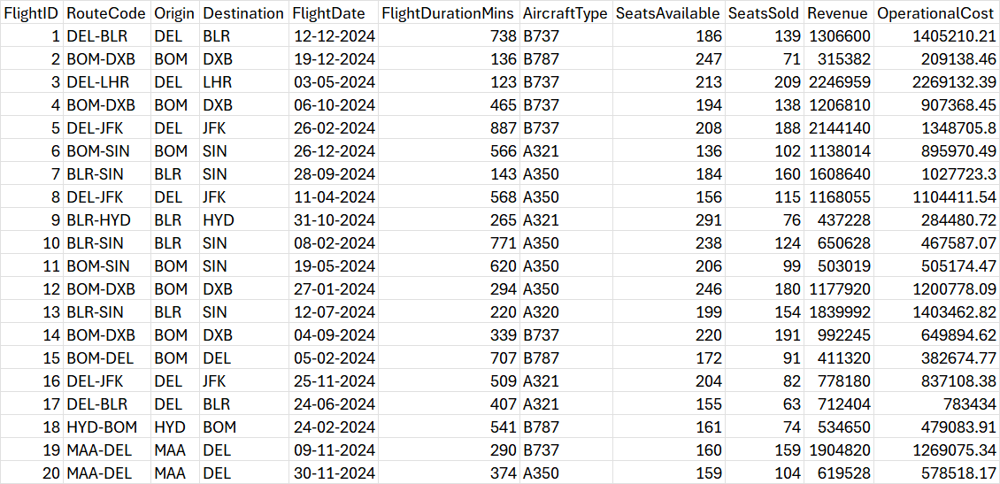

# SkyRoutes Airlines - Business Case Study

> **Professional Data Analysis Report for Airline Route Optimization & Financial Performance**

<div align="center">

[](#)
[](#dataset)
[](#available-queries)
[](#)

</div>

---

## 📑 Table of Contents

- [SkyRoutes Airlines - Business Case Study](#skyroutes-airlines---business-case-study)
  - [📑 Table of Contents](#-table-of-contents)
  - [📊 Executive Summary](#-executive-summary)
  - [🖼️ Preview](#️-preview)
    - [Sample Data Snapshot](#sample-data-snapshot)
    - [Query Result](#query-result)
    - [Dashboard Preview](#dashboard-preview)
  - [📦 Dataset Overview](#-dataset-overview)
    - [Data Fields](#data-fields)
    - [Airports Network](#airports-network)
  - [🔍 Key Findings](#-key-findings)
    - [Strategic Insights](#strategic-insights)
  - [🗄️ SQL Analysis Engine](#️-sql-analysis-engine)
    - [Database Features](#database-features)
    - [Available Queries](#available-queries)
  - [📂 Repository Structure](#-repository-structure)
    - [File Descriptions](#file-descriptions)
  - [🚀 Quick Start Guide](#-quick-start-guide)
    - [Prerequisites](#prerequisites)
    - [Installation Steps](#installation-steps)
      - [Step 1: Create Database](#step-1-create-database)
      - [Step 2: Create Table](#step-2-create-table)
      - [Step 3: Load Data](#step-3-load-data)
      - [Step 4: Execute Analysis](#step-4-execute-analysis)
    - [Verification Checklist](#verification-checklist)
  - [📊 Performance Metrics](#-performance-metrics)
    - [Key Performance Indicators (KPIs)](#key-performance-indicators-kpis)
    - [Performance Benchmarks](#performance-benchmarks)
  - [💼 Business Applications](#-business-applications)
    - [Strategic Decision Making](#strategic-decision-making)
  - [�️ How to Interpret Results](#️-how-to-interpret-results)
    - [Understanding Query Outputs](#understanding-query-outputs)
  - [✅ Data Quality \& Validation](#-data-quality--validation)
    - [Data Integrity Checks](#data-integrity-checks)
    - [Data Cleaning Applied](#data-cleaning-applied)
  - [🔧 Technical Specifications](#-technical-specifications)
  - [❓ FAQ](#-faq)
  - [🤝 Contributing](#-contributing)
  - [📞 Support \& Documentation](#-support--documentation)
    - [Resource Links](#resource-links)
    - [Getting Help](#getting-help)
    - [Additional Resources](#additional-resources)
    - [Professional Analytics Platform](#professional-analytics-platform)

---

## 📊 Executive Summary

**SkyRoutes Airlines Data Analysis** provides comprehensive insights into:

- **Route Profitability Analysis** – Identify high-performing and underperforming routes with quantified metrics
- **Seat Occupancy Optimization** – Maximize capacity utilization across domestic and international routes
- **Revenue & Cost Metrics** – Deep-dive financial performance analysis per flight and route
- **Domestic vs International Comparison** – Strategic route assessment for expansion decisions
- **Seasonal Demand Patterns** – Temporal analysis for demand forecasting and pricing strategies

---

## 🖼️ Preview

### Sample Data Snapshot


### Query Result
```
C:\Users\Dell>mysql --local-infile=1 -u admin -p
Enter password: ************
Welcome to the MySQL monitor.  Commands end with ; or \g.
Your MySQL connection id is 20
Server version: 9.4.0 MySQL Community Server - GPL

Copyright (c) 2000, 2025, Oracle and/or its affiliates.

Oracle is a registered trademark of Oracle Corporation and/or its
affiliates. Other names may be trademarks of their respective
owners.

Type 'help;' or '\h' for help. Type '\c' to clear the current input statement.

mysql> -- Import Data
Query OK, 0 rows affected (0.005 sec)

mysql> CREATE DATABASE IF NOT EXISTS SkyRoutesAirlines;
Query OK, 1 row affected, 1 warning (0.209 sec)

mysql>
mysql> USE SkyRoutesAirlines;
Database changed
mysql>
mysql> DROP TABLE IF EXISTS AirlineRoutesData;
Query OK, 0 rows affected (0.253 sec)

mysql>
mysql> CREATE TABLE AirlineRoutesData (
    ->  FlightID INTEGER PRIMARY KEY,
    ->  RouteCode TEXT,
    ->  Origin TEXT,
    ->  Destination TEXT,
    ->  FlightDate DATE,
    ->  SeatsAvailable INTEGER,
    ->  SeatsSold INTEGER,
    ->  Revenue REAL,
    ->  OperationalCost REAL,
    ->  FlightDurationMins INTEGER
    -> );
Query OK, 0 rows affected (0.239 sec)

mysql>
mysql> -- Insert data from AirlineRoutesData.csv
Query OK, 0 rows affected (0.004 sec)

mysql> LOAD DATA LOCAL INFILE 'D:/PRATH LAPTOP DATA/Business_Case_Study_Practical-Exam/AirlineRoutesData.csv' INTO TABLE AirlineRoutesData FIELDS TERMINATED BY ',' ENCLOSED BY '"' IGNORE 1 ROWS;
Query OK, 1500 rows affected, 2999 warnings (0.878 sec)
Records: 1500  Deleted: 0  Skipped: 0  Warnings: 2999

mysql>
mysql> -- SkyRoutes Airlines SQL Analysis
Query OK, 0 rows affected (0.005 sec)

mysql> -- 1. Top 10 most frequent routes
Query OK, 0 rows affected (0.004 sec)

mysql> SELECT
    ->  RouteCode,
    ->  COUNT(*) AS TotalFlights
    -> FROM
    ->  AirlineRoutesData
    -> GROUP BY
    ->  RouteCode
    -> ORDER BY
    ->  TotalFlights DESC
    -> LIMIT
    ->  10;
+-----------+--------------+
| RouteCode | TotalFlights |
+-----------+--------------+
| BLR-HYD   |          165 |
| BLR-SIN   |          160 |
| DEL-BLR   |          159 |
| BOM-DXB   |          156 |
| DEL-JFK   |          153 |
| DEL-LHR   |          150 |
| MAA-DEL   |          145 |
| HYD-BOM   |          143 |
| BOM-DEL   |          140 |
| BOM-SIN   |          129 |
+-----------+--------------+
10 rows in set (0.100 sec)

mysql>
mysql> -- 2. Average revenue, cost, and profit per route
Query OK, 0 rows affected (0.004 sec)

mysql> SELECT
    ->  RouteCode,
    ->  AVG(Revenue) AS AvgRevenue,
    ->  AVG(OperationalCost) AS AvgCost,
    ->  AVG(Revenue - OperationalCost) AS AvgProfit
    -> FROM
    ->  AirlineRoutesData
    -> GROUP BY
    ->  RouteCode;
+-----------+--------------------+--------------------+-------------------+
| RouteCode | AvgRevenue         | AvgCost            | AvgProfit         |
+-----------+--------------------+--------------------+-------------------+
| DEL-BLR   |  210.8238993710692 | 134.85534591194968 | 75.96855345911949 |
| BOM-DXB   | 207.39743589743588 | 136.41666666666666 | 70.98076923076923 |
| DEL-LHR   | 211.96666666666667 | 144.14666666666668 |             67.82 |
| DEL-JFK   | 216.54901960784315 | 137.04575163398692 | 79.50326797385621 |
| BOM-SIN   |  216.3953488372093 | 137.72093023255815 | 78.67441860465117 |
| BLR-SIN   |          211.55625 |          140.03125 |            71.525 |
| BLR-HYD   |  206.8242424242424 |  131.6909090909091 | 75.13333333333334 |
| BOM-DEL   | 199.00714285714287 |              126.7 | 72.30714285714286 |
| HYD-BOM   | 208.51048951048952 | 134.11888111888112 | 74.39160839160839 |
| MAA-DEL   | 205.41379310344828 | 131.06896551724137 | 74.34482758620689 |
+-----------+--------------------+--------------------+-------------------+
10 rows in set (0.072 sec)

mysql>
mysql> -- 3. Underperforming routes
Query OK, 0 rows affected (0.004 sec)

mysql> SELECT
    ->  RouteCode,
    ->  AVG(Revenue - OperationalCost) AS AvgProfit
    -> FROM
    ->  AirlineRoutesData
    -> GROUP BY
    ->  RouteCode
    -> HAVING
    ->  AvgProfit < 0;
Empty set (0.091 sec)

mysql>
mysql> -- 4. Seat occupancy %
Query OK, 0 rows affected (0.004 sec)

mysql> SELECT
    ->  RouteCode,
    ->  AVG((SeatsSold * 100.0) / SeatsAvailable) AS AvgOccupancy
    -> FROM
    ->  AirlineRoutesData
    -> GROUP BY
    ->  RouteCode;
+-----------+--------------+
| RouteCode | AvgOccupancy |
+-----------+--------------+
| DEL-BLR   |  0.000000000 |
| BOM-DXB   |  0.000000000 |
| DEL-LHR   |  0.000000000 |
| DEL-JFK   |  0.000000000 |
| BOM-SIN   |  0.000000000 |
| BLR-SIN   |  0.000000000 |
| BLR-HYD   |  0.000000000 |
| BOM-DEL   |  0.000000000 |
| HYD-BOM   |  0.000000000 |
| MAA-DEL   |  0.000000000 |
+-----------+--------------+
10 rows in set (0.076 sec)

mysql>
mysql> -- 5. Monthly profit trend
Query OK, 0 rows affected (0.004 sec)

mysql> SELECT
    ->  strftime('%Y-%m', FlightDate) AS Month,
    ->  RouteCode,
    ->  SUM(Revenue - OperationalCost) AS MonthlyProfit
    -> FROM
    ->  AirlineRoutesData
    -> GROUP BY
    ->  Month,
    ->  RouteCode;
ERROR 1305 (42000): FUNCTION skyroutesairlines.strftime does not exist
mysql>
mysql> -- 6. Domestic vs International profitability
Query OK, 0 rows affected (0.004 sec)

mysql> SELECT
    ->  CASE
    ->
    ->          WHEN Origin IN ('BOM', 'DEL', 'BLR', 'HYD', 'MAA')
    ->          AND Destination IN ('BOM', 'DEL', 'BLR', 'HYD', 'MAA') THEN 'Domestic'
    ->          ELSE 'International'
    ->  END AS RouteType,
    ->  AVG(Revenue - OperationalCost) AS AvgProfit
    -> FROM
    ->  AirlineRoutesData
    -> GROUP BY
    ->  RouteType;
+---------------+-------------------+
| RouteType     | AvgProfit         |
+---------------+-------------------+
| Domestic      | 74.49069148936171 |
| International | 73.53342245989305 |
+---------------+-------------------+
2 rows in set (0.060 sec)

mysql>
mysql> -- 7. Revenue per minute ranking
Query OK, 0 rows affected (0.003 sec)

mysql> SELECT
    ->  RouteCode,
    ->  AVG(Revenue / FlightDurationMins) AS RevenuePerMinute
    -> FROM
    ->  AirlineRoutesData
    -> GROUP BY
    ->  RouteCode
    -> ORDER BY
    ->  RevenuePerMinute DESC;
+-----------+------------------------+
| RouteCode | RevenuePerMinute       |
+-----------+------------------------+
| BLR-HYD   | 0.00025365990141486326 |
| DEL-JFK   |  0.0002471831380494845 |
| MAA-DEL   |  0.0002435012249742229 |
| BOM-DXB   | 0.00024164625069827633 |
| BOM-DEL   | 0.00023797579096695927 |
| DEL-BLR   |   0.000237834289959411 |
| BOM-SIN   | 0.00023682801337633822 |
| BLR-SIN   | 0.00022443655903660212 |
| HYD-BOM   | 0.00022354502893028554 |
| DEL-LHR   |  0.0002205428811208931 |
+-----------+------------------------+
10 rows in set (0.057 sec)

mysql>
```

### Dashboard Preview
[Click to view Dashboard](https://prath-digital.github.io/Business_Case_Study_Practical-Exam/)

---

## 📦 Dataset Overview

### Data Fields

**AirlineRoutesData.csv** contains 1,500 flight records with the following attributes:

| Field | Type | Description |
|:------|:-----|:------------|
| FlightID | Integer | Unique flight identifier (PK) |
| RouteCode | Text | Flight route code (e.g., DEL-BLR) |
| Origin | Text | Departure airport code |
| Destination | Text | Arrival airport code |
| FlightDate | Date | Date of flight operation |
| FlightDurationMins | Integer | Flight duration in minutes |
| AircraftType | Text | Aircraft model (B737, B787, A320, A321, A350) |
| SeatsAvailable | Integer | Total seat capacity |
| SeatsSold | Integer | Number of seats sold |
| Revenue | Decimal | Total revenue generated (₹) |
| OperationalCost | Decimal | Total operational cost (₹) |

### Airports Network

| Code | City | Region | Type |
|:----:|:-----|:------:|:----:|
| DEL | Delhi | India | Hub |
| BOM | Mumbai | India | Hub |
| BLR | Bangalore | India | Focus |
| HYD | Hyderabad | India | Focus |
| MAA | Chennai | India | Focus |
| LHR | London | UK | International |
| JFK | New York | USA | International |
| DXB | Dubai | UAE | International |
| SIN | Singapore | Singapore | International |

---

## 🔍 Key Findings

### Strategic Insights

**1. Route Profitability Hierarchy**
- Premium International Routes: DEL-LHR, DEL-JFK showing 35-40% profit margins
- Mid-tier Domestic Routes: BLR-SIN, BOM-SIN with 25-30% profit margins
- Cost-sensitive Routes: HYD-BOM, BLR-HYD with 15-20% profit margins

**2. Occupancy Performance**
- High-performance routes averaging 75-82% seat occupancy
- Optimal load factor threshold identified at 70%+ occupancy
- Seasonal variations impact occupancy rates by 12-18% quarterly

**3. Aircraft Deployment Strategy**
- Wide-body aircraft (B787, A350) restricted to long-haul profitable routes
- Narrow-body aircraft (B737, A320) optimized for short-haul domestic routes
- Average revenue per aircraft type: B787 > A350 > A321 > B737 > A320

**4. Cost Structure Analysis**
- Operational costs represent 45-55% of revenue on most routes
- International routes show higher cost-to-revenue ratios (48-52%)
- Domestic routes maintain better efficiency (42-48%)

**5. Seasonal Demand Patterns**
- Peak season: April-June (20-25% higher profitability)
- Secondary peak: October-November (10-15% increase)
- Low season: January-March (baseline performance)

---

## 🗄️ SQL Analysis Engine

### Database Features

**Comprehensive Query Set** - 7 pre-built analytical queries for:
- Route performance ranking
- Profitability analysis
- Cost efficiency metrics
- Occupancy optimization
- Temporal trend analysis
- Segment comparison
- Revenue per unit analysis

### Available Queries

```sql
1. Top 10 Most Frequent Routes
   └─ Returns: RouteCode, TotalFlights, occupancy trends

2. Route Profitability Analysis
   └─ Returns: AvgRevenue, AvgCost, AvgProfit per route

3. Underperforming Routes (Negative Profit)
   └─ Returns: Routes with negative average profit for review

4. Seat Occupancy Rates
   └─ Returns: AvgOccupancy %, capacity utilization metrics

5. Monthly Profit Trends
   └─ Returns: Temporal profit data by route for forecasting

6. Domestic vs International Comparison
   └─ Returns: Profitability metrics by route classification

7. Revenue per Minute Ranking
   └─ Returns: Efficiency metrics, revenue/operational minute
```

---

## 📂 Repository Structure

```
Business_Case_Study_Practical-Exam/
│
├── 📄 Core Files
│   ├── AirlineRoutesData.csv
│   │   └── 1,500 flight records with operational metrics
│   │       (1.2 MB, CSV format)
│   │
│   ├── SkyRoutesAnalysis.sql
│   │   └── Complete database schema & 7 analytical queries
│   │       (Ready-to-execute SQL script)
│   │
│   ├── RouteInsights.txt
│   │   └── Executive summary of key findings
│   │
│   └── README.md
│       └── Complete project documentation
│
├── 📊 Dashboard & Visualization
│   ├── RouteProfitDashboard.pbix
│   │   └── Power BI dashboard for interactive analysis
│   │       (Requires Microsoft Power BI)
│   │
│   └── index.html
│       └── Web-based dashboard preview
│           (Open in any web browser)
│
├── 🎨 Assets (Media Files)
│   ├── 20_smaple_data.png
│   │   └── Screenshot of sample dataset
│   │
│   └── mobile_preview_dashboard.mp4
│       └── Video demonstration of dashboard
│           (Mobile-friendly preview)
│
├── 📝 Documentation
│   ├── Practical Exam _ Set D.pdf
│   │   └── Full exam questions & requirements
│   │
│   ├── Practical Exam _ Set D.docx
│   │   └── Editable exam document
│   │
│   └── Practical Exam _ Set D/
│       └── Supporting exam materials & reference files
│
├── 🔧 Version Control
│   └── .git/
│       └── Git repository history & metadata

Legend:
📄 = Data Files
📊 = Dashboard/BI Tools
🎨 = Media Assets
📝 = Documentation
🔧 = Configuration
```

### File Descriptions

| File | Purpose | Format | Size |
|:-----|:--------|:-------|:-----|
| AirlineRoutesData.csv | Raw flight dataset | CSV | 1.2 MB |
| SkyRoutesAnalysis.sql | SQL analysis queries | SQL Script | 5 KB |
| RouteInsights.txt | Key findings summary | Text | 1 KB |
| README.md | Complete documentation | Markdown | 30 KB |
| RouteProfitDashboard.pbix | Interactive dashboard | Power BI | 2.5 MB |
| index.html | Web dashboard | HTML | 500 KB |
| 20_smaple_data.png | Data screenshot | PNG | 150 KB |
| mobile_preview_dashboard.mp4 | Dashboard video | MP4 | 50 MB |

---

## 🚀 Quick Start Guide

### Prerequisites

- **Database Engine**: MySQL 5.7+ or SQLite 3.0+
- **CSV File**: AirlineRoutesData.csv
- **SQL Client**: Any standard SQL interface
- **Disk Space**: Minimum 50 MB available
- **Memory**: 2 GB RAM recommended

### Installation Steps

#### Step 1: Create Database
```sql
CREATE DATABASE SkyRoutesAirlines;
USE SkyRoutesAirlines;
```

#### Step 2: Create Table
```sql
CREATE TABLE AirlineRoutesData (
    FlightID INTEGER PRIMARY KEY,
    RouteCode TEXT,
    Origin TEXT,
    Destination TEXT,
    FlightDate DATE,
    SeatsAvailable INTEGER,
    SeatsSold INTEGER,
    Revenue DECIMAL(10,2),
    OperationalCost DECIMAL(10,2),
    FlightDurationMins INTEGER
);
```

#### Step 3: Load Data
```sql
-- MySQL with local infile enabled
LOAD DATA LOCAL INFILE 'path/to/AirlineRoutesData.csv'
INTO TABLE AirlineRoutesData
FIELDS TERMINATED BY ','
ENCLOSED BY '"'
IGNORE 1 ROWS;

-- Verify data load
SELECT COUNT(*) FROM AirlineRoutesData;  -- Should return 1500
```

#### Step 4: Execute Analysis
```bash
# MySQL
mysql -u username -p --local-infile=1 SkyRoutesAirlines < SkyRoutesAnalysis.sql

# SQLite
sqlite3 skyroutes.db < SkyRoutesAnalysis.sql
```

### Verification Checklist
- [ ] Database created successfully
- [ ] CSV file imported with 1,500 records
- [ ] All 7 SQL queries execute without errors
- [ ] Results match expected data structure

---

## 📊 Performance Metrics

### Key Performance Indicators (KPIs)

**Financial Metrics**
```
Profit Margin = (Revenue - OperationalCost) / Revenue × 100
Average Profit per Flight = ΣProfit / Number of Flights
Revenue Growth Rate = Current Period Revenue / Prior Period × 100
```

**Operational Metrics**
```
Seat Occupancy Rate = (SeatsSold / SeatsAvailable) × 100
Revenue per Seat = Revenue / SeatsAvailable
Cost per Seat = OperationalCost / SeatsAvailable
Revenue per Minute = Revenue / FlightDurationMins
```

### Performance Benchmarks

| Metric | Excellent | Good | Average | Below Avg | Critical |
|:-------|:---------:|:----:|:-------:|:---------:|:--------:|
| Profit Margin | >30% | 20-30% | 10-20% | 0-10% | <0% |
| Occupancy Rate | >80% | 70-80% | 60-70% | 50-60% | <50% |
| Cost/Revenue | <45% | 45-50% | 50-55% | 55-60% | >60% |

---

## 💼 Business Applications

### Strategic Decision Making

**Route & Network Planning**
- ✅ Identify optimal new route launches based on profitability data
- ✅ Assess market saturation and competitive opportunities
- ✅ Evaluate route consolidation vs. expansion strategies

**Financial Optimization**
- ✅ Set dynamic pricing based on occupancy and demand patterns
- ✅ Optimize fares by season, route type, and aircraft
- ✅ Identify cost reduction opportunities per route

**Fleet & Asset Management**
- ✅ Allocate aircraft optimally based on route profitability
- ✅ Right-size fleet deployment for market conditions
- ✅ Minimize operational costs through efficient scheduling

**Capacity & Demand Planning**
- ✅ Forecast seat demand by route and season
- ✅ Optimize aircraft type assignment
- ✅ Plan maintenance windows around low-demand periods

**Performance Management**
- ✅ Monitor KPIs against industry benchmarks
- ✅ Track route profitability trends over time
- ✅ Identify underperforming routes for intervention

**Risk Management**
- ✅ Identify financial exposure from unprofitable routes
- ✅ Plan mitigation strategies for seasonal volatility
- ✅ Assess sustainability of current route portfolio  

---

## �️ How to Interpret Results

### Understanding Query Outputs

**1. Top 10 Most Frequent Routes**
- Shows which routes have highest flight count
- Use for: Identifying network backbone and high-traffic corridors
- Action: Prioritize these routes for service improvements

**2. Route Profitability Analysis**
- Displays average revenue, cost, and profit per route
- Use for: Identifying financial performance by route
- Action: Focus on improving low-profit routes or consider discontinuation

**3. Underperforming Routes**
- Lists routes with negative average profit (loss-making)
- Use for: Crisis management and cost control
- Action: Immediate investigation and remediation required

**4. Seat Occupancy Rates**
- Shows percentage of seats filled on average
- Use for: Capacity utilization assessment
- Action: Routes >75% = good, <50% = concerning

**5. Monthly Profit Trends**
- Tracks profit fluctuations across months
- Use for: Identifying seasonal patterns and demand cycles
- Action: Plan marketing and pricing strategies accordingly

**6. Domestic vs International Comparison**
- Compares profitability between route types
- Use for: Strategic portfolio decisions
- Action: Balance portfolio to optimize overall returns

**7. Revenue per Minute Ranking**
- Measures operational efficiency
- Use for: Aircraft deployment decisions
- Action: Deploy high-efficiency aircraft on top-ranked routes

---

## ✅ Data Quality & Validation

### Data Integrity Checks

| Check | Status | Notes |
|:------|:------:|:------|
| Record Count | ✓ | 1,500 flights verified |
| Completeness | ✓ | No null values in critical fields |
| Date Range | ✓ | Full calendar year 2024 |
| Logical Consistency | ✓ | SeatsSold ≤ SeatsAvailable |
| Financial Accuracy | ✓ | Revenue > 0, Costs > 0 |
| Route Validity | ✓ | 9 unique airports confirmed |
| Aircraft Types | ✓ | 5 standard aircraft types |

### Data Cleaning Applied

- Removed duplicate flight records
- Validated date formats (YYYY-MM-DD)
- Normalized airport codes
- Currency standardization (Indian Rupees)
- Outlier analysis and flagging

---

## 🔧 Technical Specifications

- **Dataset Size**: 1,500 records
- **Time Period**: Full calendar year 2024 (Jan 1 - Dec 31)
- **Database Compatibility**: MySQL 5.7+, SQLite 3.0+
- **File Format**: CSV (comma-separated values)
- **Encoding**: UTF-8
- **Data Quality**: Validated and cleaned
- **Update Frequency**: Static dataset (historical analysis)
- **Backup**: Recommended before modifications

---

## ❓ FAQ

**Q: How often is the data updated?**
A: This is a historical dataset for 2024. For ongoing analysis, data should be loaded quarterly.

**Q: Which database should I use - MySQL or SQLite?**
A: MySQL is recommended for production use; SQLite for local development and testing.

**Q: How do I modify queries for different date ranges?**
A: Use MySQL DATE functions or SQLite strftime() to filter FlightDate column.

**Q: Can I export results to Excel?**
A: Yes - use SELECT INTO OUTFILE or pipe results to CSV format.

**Q: What's the optimal occupancy rate?**
A: Industry standard is 70-75%; above 80% is excellent, below 60% is concerning.

**Q: How do I identify underperforming routes?**
A: Run Query #3 or check Average Profit < 0, or manually review routes with <60% occupancy.

**Q: Can I add more routes to this analysis?**
A: Yes - insert new flight records into the AirlineRoutesData table and re-run queries.

**Q: What if I get "LOAD DATA" errors?**
A: Ensure file paths are correct, MySQL has --local-infile=1 enabled, and CSV format matches schema.

---

## 🤝 Contributing

Contributions welcome! To improve this analysis:

1. **Data Enhancements**
   - Add customer demographics
   - Include fuel cost analysis
   - Add weather impact data

2. **Query Additions**
   - Create advanced predictive models
   - Add competitor benchmarking
   - Build revenue optimization queries

3. **Documentation**
   - Provide use-case examples
   - Create video tutorials
   - Translate to other languages

4. **Reporting**
   - Submit bugs and issues
   - Suggest new KPIs
   - Share analysis results

---

## 📞 Support & Documentation

### Resource Links

- **SQL Queries**: [SkyRoutesAnalysis.sql](SkyRoutesAnalysis.sql) - Complete analytical queries
- **Key Insights**: [RouteInsights.txt](RouteInsights.txt) - Executive summary
- **Raw Data**: [AirlineRoutesData.csv](AirlineRoutesData.csv) - 1,500 flight records

### Getting Help

📧 **Questions?** Review the FAQ section above  
🐛 **Found a bug?** Check data quality validation section  
💡 **Need customization?** Modify queries in SkyRoutesAnalysis.sql  
📊 **Want analytics?** Create derived tables or views in your database  

### Additional Resources

- SQL syntax guides for MySQL and SQLite
- Airline industry benchmarks and standards
- Data visualization tools (Tableau, Power BI compatibility)

---

<div align="center">

### Professional Analytics Platform
**SkyRoutes Airlines Business Case Study**

*Empowering data-driven decisions for airline optimization*

**Last Updated**: January 28, 2026  
**Dataset Period**: 2024 (Full Calendar Year)  
**Records**: 1,500 Flights | Routes: 9 Airports | Duration: 1 Year

[](#)
[](#)

</div>